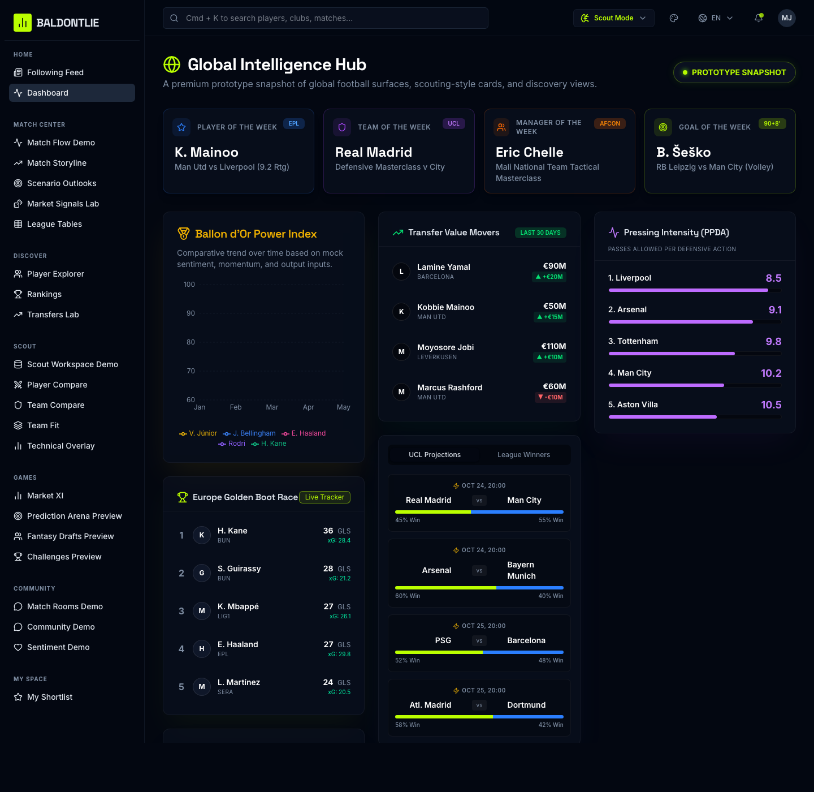
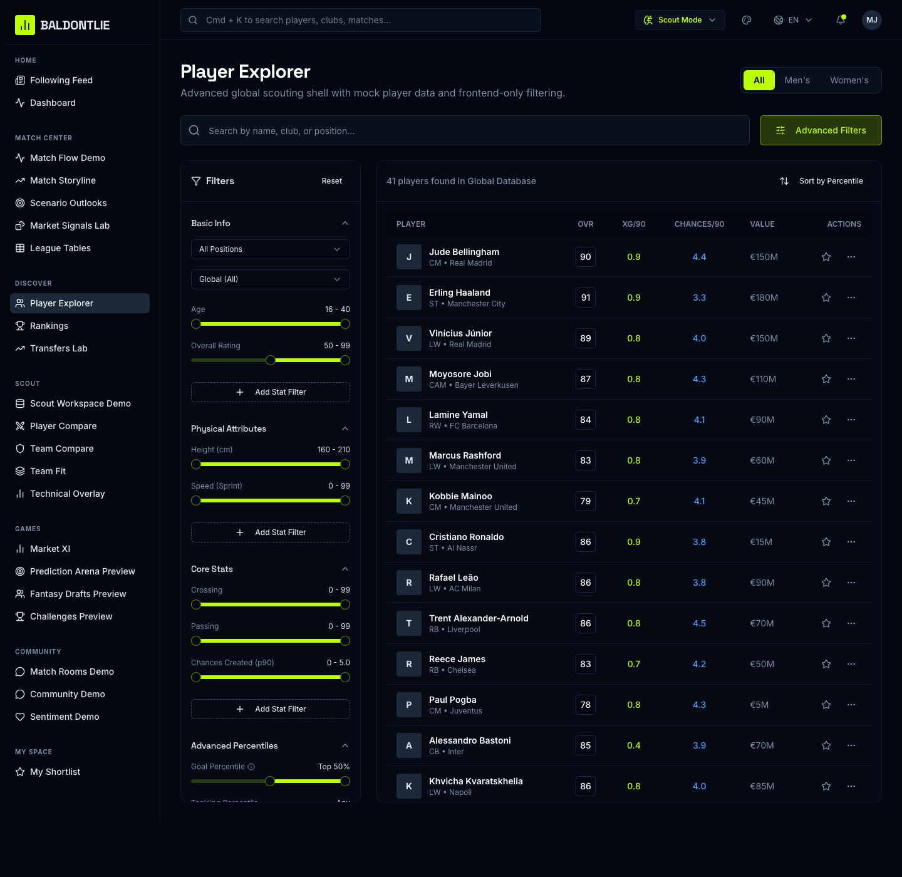
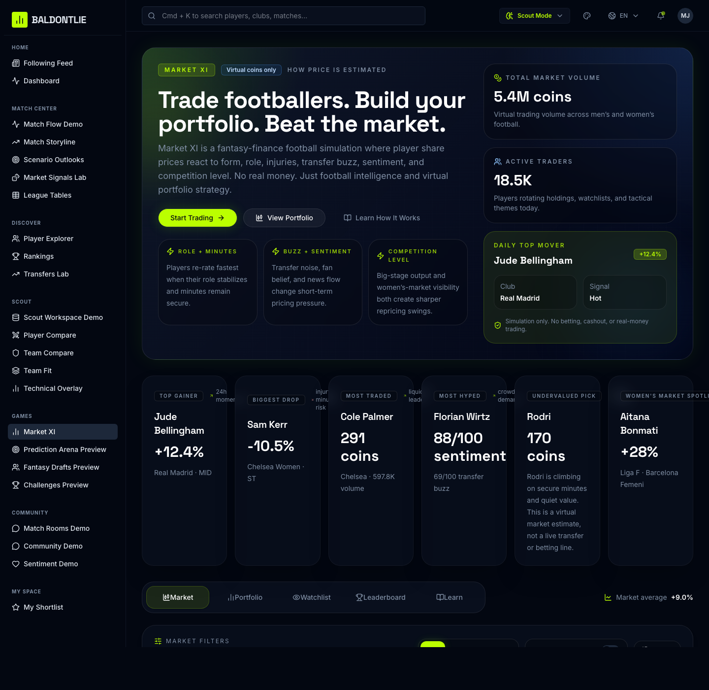

# BALDONTLIE

Premium football intelligence product prototype with scouting, player discovery, transfers, rankings, simulations, and a dedicated `Games` area led by `Market XI`.

This repository is currently strongest as a **premium football frontend prototype** and is being tightened into a **truthful, terminal-first production build**.

---

## 1. What This Repo Is

BALDONTLIE is a football-first product system aiming to combine:
- live football utility
- player/team/match intelligence
- compare and ranking flows
- selective scouting-style discovery
- safe simulation-only game mechanics
- a polished, premium dark interface

It is **not** a sportsbook, not a betting app, not an unmoderated social firehose, and not a fake-live demo.

---

## 2. Where The Real App Lives

The working application lives in:

- `source-code/client/` — React + Vite frontend
- `source-code/server/` — Express wrapper / API scaffold
- `source-code/shared/` — shared schema/types

Primary current-state repo reference:
- `REPO_OVERVIEW.md`

---

## 3. Current Status

### In place
- premium dark football UI
- broad multi-page product shell
- shell route statuses now distinguish launch, beta, and demo surfaces
- dashboard, players, transfers, predictions, rankings, and other football prototype routes
- newer `Games` feature area
- polished `Market XI` frontend simulation
- fuller dashboard/feed/transfers/community/preview layouts in the real `source-code` app
- truthful system metadata endpoints:
  - `/api/health`
  - `/api/system/readiness`
  - `/api/system/routes`
- working local app boot/build/typecheck

### Not yet in place
- real broad backend APIs
- meaningful database-backed app behavior
- complete auth flow in use
- complete test suite
- lint pipeline
- production-grade observability
- truthful data backbone across the launch slice

Current backend-prep truth:

- the frontend now reads a real readiness endpoint on the dashboard
- the readiness endpoint reports repo/app status only
- it does not provide live football providers, real search, or production feature data yet

### Visual Snapshot

Dashboard:



Player Explorer:



Market XI:



---

## 4. Source-Of-Truth Docs

These are the live planning docs:

- `BALDONTLIE_PRODUCTION_PLAN.md` — detailed source-of-truth production plan
- `BALDONTLIE_PRODUCTION_CHECKLIST.md` — exhaustive execution checklist
- `PRODUCTION_RELEASE_RUNBOOK.md` — operator flow for taking the project from repo state to release
- `WORKING_CONVENTIONS.md` — day-to-day repo rules for task flow, progress logging, verification, and demo sync
- `MOYOSOREJOBI_STYLE.md` — writing, comment, and commit style rule
- `REPO_OVERVIEW.md` — exact current-state repo reference only
- `PROGRESS.md` — append-only timestamped progress log for changes, bugs, failures, blockers, and next steps
- `FRONTEND_VISUAL_REFERENCE.md` — screenshot gallery of the current frontend demo
- `TASK_EXECUTION_TEMPLATE.md` — reusable template for starting and carrying individual tasks cleanly

Implementation handoff:

- `DEV_START_HERE.md` — first-session execution guide for AI-assisted work in VS Code
- `WORKING_CONVENTIONS.md` — practical execution rules that apply during normal day-to-day work
- `ROUTE_INVENTORY.md` — current route map with recommended `launch` / `beta` / `hide` / `later` status
- `FRONTEND_VISUAL_REFERENCE.md` — current screenshot gallery for demo and review
- `TASK_EXECUTION_TEMPLATE.md` — use this when starting a meaningful new feature, bug, or task slice

Documentation workflow:

- `PROGRESS.md` must be updated continuously as work happens
- `PROGRESS.md` should never lose old entries; it should grow like a history log
- every meaningful code, config, doc, or infra change should be logged with time, files, commands, outcomes, issues, and next steps
- `REPO_OVERVIEW.md` should be rewritten in place whenever the current repo shape changes
- `REPO_OVERVIEW.md` should describe the repo exactly as it is now, not what it used to be or might become later
- every meaningful frontend UI change should capture updated screenshot(s) and refresh the visual docs when useful
- screenshot history in `FRONTEND_VISUAL_REFERENCE.md` should grow by appending new sections instead of replacing older screenshot history

Demo path:

- `../frontend-demo/` contains the standalone frontend-only demo copy for local demos and UI review
- `../frontend-demo/` is a mirror for presentation, not the implementation source of truth
- use `npm run sync:demo` from the repo root after meaningful frontend changes that should appear in the demo

These remain supporting research inputs only:

- `PERPLEXITY_RESEARCH.md`
- `CHATGPT_DEEP_RESEARCH.md`
- `CHAT_EXTENDED_RESEARCH.md`
- `AI_RESEARCH.md`
- `GEMINI_RESEARCH.md`
- `ULTIMATE_FOOTBALL_PROJECT_PLAN.md`
- `FOOTBALL_RESEARCH_PROMPT.md`

---

## 5. Operating Rule: Terminal First

Everything that can reasonably be done from the VS Code terminal should be done from the VS Code terminal first.

Preferred execution tools:

- Codex
- shell commands
- repo scripts
- CLIs
- CI workflows

Use GUI/manual tools only when truly required, mainly for:
- Xcode signing / packaging / real-device verification
- App Store Connect / TestFlight steps
- one-time cloud console steps if CLI is blocked or slower than justified

Whenever a step must leave the terminal:
1. do the shortest manual step possible
2. document why
3. return to terminal-driven workflow immediately

---

## 6. Local Development

From the repo root:

```bash
npm run bootstrap
npm run check
npm run build
npm run dev
```

Direct subproject workflow still works when needed.

From `source-code/`:

```bash
npm install
npm run dev
```

Typical local URL:

```text
http://127.0.0.1:5000
```

If `5000` is occupied on the local machine, use a safe override such as:

```bash
cd ../source-code
PORT=5004 npm run dev
```

Recommended baseline checks:

```bash
cd source-code
npm run check
npm run build
npm run dev
```

Environment setup:

- copy `source-code/.env.example` to a local `.env` only when you need DB-backed work
- for most current frontend work, `npm run dev`, `npm run check`, and `npm run build` should work without extra secrets

---

## 7. Scripts

Repo-level scripts now include:

- `npm run bootstrap`
- `npm run dev`
- `npm run dev:demo`
- `npm run check`
- `npm run build`
- `npm run sync:demo`
- `npm run clean:os`

Subproject scripts from `source-code/package.json` include:

- `npm run dev`
- `npm run build`
- `npm run start`
- `npm run check`
- `npm run db:push`

As the repo hardens, the standard terminal workflow should also include:
- `npm run lint`
- `npm run lint:fix`
- `npm run format`
- `npm run format:check`
- `npm run test`
- `npm run test:e2e`

---

## 8. Launch Posture

The locked first-launch posture is:

- ship a narrow truthful football product first
- web first
- iOS packaging after web stability
- keep current React + Vite frontend
- keep Express as the first API service
- use Supabase Postgres/Auth for first real persistence/auth
- deploy web to Cloudflare Pages
- deploy API to Google Cloud Run
- keep runtime lean
- use GitHub Actions for CI and scheduled sync
- keep `Market XI` clearly simulation-only
- delay infra and product breadth that is not needed for the first truthful release

---

## 9. What Is Adjustable vs Locked

### Locked
- truthful launch slice over breadth
- terminal-first execution
- `Market XI` simulation-only
- React + Vite + Express launch stack
- Cloudflare Pages + Cloud Run + Supabase + GitHub Actions + Sentry
- Capacitor for first iOS packaging
- no immediate monorepo migration
- no Redis/ClickHouse in launch path

### Adjustable
- exact launch competitions
- exact provider choice
- whether login is required for launch
- polling intervals
- which routes are `launch` vs `hide`
- final copy/details inside Learn/Fan/Scout presentation later

### Deferred
- Redis
- ClickHouse
- websocket-heavy live systems
- broad community
- production AI assistant
- React Native / Expo rewrite
- deep scout workspace
- wide long-tail competition support

---

## 10. What Must Happen Before Public Launch

Minimum truth requirements:
- real search
- real player page
- real team page
- one real competition table
- one real match center
- source labels
- freshness timestamps
- honest loading/empty/error states
- no fake AI presented as real

---

## 11. Cloud / CLI Execution Map

### Terminal-first
These should be attempted from terminal first:
- dependency install
- lint/typecheck/build/test
- route audits and refactors
- local Supabase setup
- migrations
- API contract generation
- Cloud Run deploy via `gcloud`
- Cloudflare Pages deploy via `wrangler` or Git-connected workflow
- Capacitor init/add/sync/open
- CI changes
- release notes and docs

### Usually manual or partly manual
These normally leave the terminal briefly:
- Xcode signing
- real-device iPhone verification
- App Store Connect / TestFlight metadata
- App Store submission screens

---

## 12. Repo Truth Reminder

This repository currently contains:
- a lot of strong UI
- a lot of mocked intelligence
- a thin backend scaffold
- a better modular example in `client/src/features/games/market-xi`

The goal is not to pretend it is already production-ready.
The goal is to turn it into a truthful, testable, deployable football product without throwing away the strongest frontend work.

---

## 13. Working Style

Recommended execution style:
- small focused branches
- terminal-first commands
- one route/slice at a time
- every risky change gets a rollback path
- every launch-critical feature gets:
  - source label
  - timestamp
  - loading state
  - empty state
  - error state
  - retry path

If a feature cannot be made truthful in time, hide it from launch instead of faking readiness.
